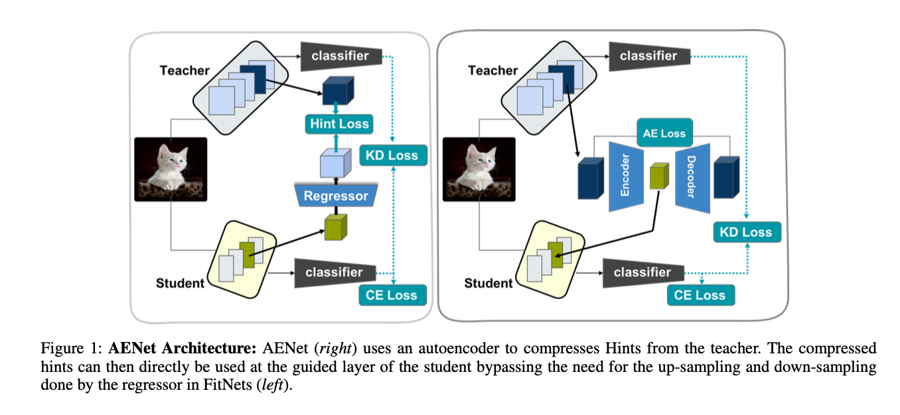

# AENet: Autoencoder-Enhanced Knowledge Distillation

> **Compressing and injecting teacher features directly into students — for stronger invariance, better OOD robustness, and tighter knowledge transfer.**

---

## Overview

Standard knowledge distillation methods like FitNets guide a student network to *approximate* teacher features via an L2 loss. This indirect alignment leaves a lot on the table — the student learns to look like the teacher's features, but never truly operates in the teacher's feature space.

**AENet** takes a different approach. A lightweight convolutional autoencoder compresses the teacher's intermediate feature map down to the student's dimensionality, and that compressed representation is **directly injected** into the student during training — replacing the student's own intermediate activations entirely. The student's later layers are then forced to solve the task using the teacher's features, not their own.

This simple change produces students that:
- Inherit the teacher's **transformation invariances** (e.g. color invariance) even without seeing augmented data
- Nearly match the teacher's accuracy on **out-of-domain test sets**
- Better exploit **large teacher models**, alleviating the classic capacity-gap problem

---

## Architecture



*Left: FitNets uses a learned regressor and an L2 hint loss to align the student's features up to the teacher's dimensionality. Right: AENet uses a lightweight convolutional autoencoder to compress the teacher's hint down to the student's dimensionality, then directly injects it into the student's guided layer — no hint loss required.*

---

## Method

### The core idea

Given a teacher hint $h_T(x) \in \mathbb{R}^{C_T \times H_T \times W_T}$ and a student guided layer expecting features of shape $\mathbb{R}^{C_S \times H_S \times W_S}$, AENet trains a small encoder-decoder pair:

- **Encoder** $e(\cdot)$: compresses the teacher hint to the student's shape, producing latent $z(x) = e(h_T(x))$
- **Decoder** $d(\cdot)$: reconstructs the teacher's original feature from $z(x)$, used only during training

During the forward pass, $z(x)$ **replaces** the student's own activations at the guided layer. The student's layers before the injection point are bypassed entirely for that forward pass.

### Loss

$$\mathcal{L}_{\text{AENet}} = \mathcal{L}_{\text{KD}} + \mathcal{L}_{\text{AE}}$$

where $\mathcal{L}_{\text{KD}}$ is the standard knowledge distillation loss (cross-entropy + KL divergence with softened logits), and:

$$\mathcal{L}_{\text{AE}} = \frac{1}{2} \| d(e(h_T(x))) - h_T(x) \|_2^2 + \gamma \| e(h_T(x)) \|_1$$

The L1 sparsity term encourages the latent to capture only the most salient teacher features. In practice, a small $\gamma$ works best — aggressive sparsity degrades performance.

---

## Experimental Setup

All experiments use a **ResNet-50 or ResNet-152 teacher** distilling into a **ResNet-18 student**, evaluated on Top-1 classification accuracy. Four methods are compared throughout:

| Method | Description |
|---|---|
| **Logits KD** | Standard KD — student mimics teacher's softened output probabilities only |
| **FitNets** | Adds an L2 hint loss; student feature is upsampled to match teacher's hint |
| **FitNets-R** | Reversed variant — teacher hint is compressed down to student's dimension before L2 alignment |
| **AENet** | Autoencoder compresses teacher hint; compressed representation is directly injected into student |

Three evaluation settings probe what knowledge is actually transferred:

**Transformation invariance:** The teacher is trained with heavy color jitter (hue, saturation, brightness, contrast) to become color-invariant. The student is trained on clean images. Both are evaluated on a color-jittered validation set — if the student scores well, it has inherited the teacher's invariance, not just learned from augmented data.

**OOD generalization (PACS, VLCS, OfficeHome):** The teacher sees all domains during training; the student sees all but one. Performance is measured on the held-out domain. This tests whether the student can inherit the teacher's cross-domain representation, not just in-distribution accuracy.

**Capacity gap (ResNet-50 vs ResNet-152 teacher):** The same student is distilled from two teacher sizes. Under standard methods, a bigger teacher doesn't reliably produce a better student — AENet is evaluated on how well it closes this gap by making the larger teacher's knowledge digestible for the smaller student.

---

## Scripts

### `finetune.py` — Train or fine-tune a single model

Use this to train a **teacher** (or any standalone backbone) on a dataset before distillation. It supports ImageNet-pretrained weights, frozen backbones, and multiple optimizers and schedulers.

**Basic usage:**

```bash
python finetune.py \
  --dataset cifar100 \
  --dataset-root /path/to/cifar100 \
  --model-name resnet50 \
  --weights default \
  --epochs 30 \
  --lr 3e-4 \
  --out-dir runs/finetune \
  --run-name resnet50_cifar100
```

**With color jitter (for invariance experiments):**

```bash
python finetune.py \
  --dataset food101 \
  --dataset-root /path/to/food101 \
  --model-name resnet50 \
  --color-jitter paper \
  --epochs 50 \
  --run-name resnet50_food101_jitter
```

**Freeze the backbone, train head only** (by default the entire model is **_unforzen_**):

```bash
python finetune.py \
  --dataset cifar100 \
  --dataset-root /path/to/cifar100 \
  --model-name resnet50 \
  --freeze-backbone \
  --epochs 10 \
  --run-name resnet50_headonly
```

**Key arguments:**

| Argument | Default | Description |
|---|---|---|
| `--dataset` | required | `cifar100`, `food101`, `imagenet100` |
| `--dataset-root` | required | Path to dataset root |
| `--model-name` | required | torchvision model name, e.g. `resnet50`, `vit_b_16` |
| `--weights` | `default` | `default` (ImageNet pretrained), `none` (random init) |
| `--epochs` | `30` | Number of training epochs |
| `--lr` | `3e-4` | Learning rate |
| `--optimizer` | `adamw` | `adamw` or `sgd` |
| `--scheduler` | `cosine` | `cosine`, `step`, `multistep`, `none` |
| `--color-jitter` | `none` | `paper` applies heavy hue/saturation/brightness jitter |
| `--freeze-backbone` | off | Freeze all layers except the classification head |
| `--amp` | off | Enable automatic mixed precision (recommended on GPU) |
| `--resume` | `""` | Path to a checkpoint `.pt` file to resume from |

Checkpoints are saved to `runs/finetune/<run-name>/`. Both `last.pt` and `best.pt` (best validation accuracy) are written each epoch.

---

### `distill.py` — Run knowledge distillation

The main distillation script. Supports four distillation schemes under a single unified CLI:

| Scheme | Description |
|---|---|
| `sae_injection` | **AENet** — autoencoder compression + direct feature injection |
| `logit_kd` | Standard logits-based KD (Hinton et al.) |
| `dkd` | Decoupled Knowledge Distillation |
| `fitnets` | FitNets hint alignment (supports `--reverse` for FitNets-R) |

**AENet (recommended):**

```bash
python distill.py \
  --scheme sae_injection \
  --teacher-name resnet50 \
  --student-name resnet18 \
  --teacher-weights default \
  --student-weights none \
  --dataset cifar100 \
  --dataset-root /path/to/cifar100 \
  --teacher-cut layer3 \
  --student-start layer3 \
  --adapter-bottleneck-ratio 0.5 \
  --adapter-sparsity 1e-4 \
  --epochs 30 \
  --lr 3e-4 \
  --out-dir runs/distill \
  --run-name aenet_r50_r18_cifar100
```

**FitNets baseline:**

```bash
python distill.py \
  --scheme fitnets \
  --teacher-name resnet50 \
  --student-name resnet18 \
  --dataset cifar100 \
  --dataset-root /path/to/cifar100 \
  --teacher-hints layer3 \
  --student-hints layer3 \
  --epochs 30 \
  --run-name fitnets_r50_r18_cifar100
```

**FitNets-R (reversed, teacher compressed to student dim):**

```bash
python distill.py \
  --scheme fitnets \
  --reverse \
  --teacher-hints layer3 \
  --student-hints layer3 \
  ... 
```

**Logit KD baseline:**

```bash
python distill.py \
  --scheme logit_kd \
  --teacher-name resnet50 \
  --student-name resnet18 \
  --temperature 4.0 \
  --distill-weight 1.0 \
  --dataset cifar100 \
  --dataset-root /path/to/cifar100 \
  --epochs 30 \
  --run-name logitkd_r50_r18_cifar100
```

**Key arguments:**

| Argument | Default | Description |
|---|---|---|
| `--scheme` | `sae_injection` | Distillation method to use |
| `--teacher-name` | required | torchvision model name for the teacher |
| `--student-name` | required | torchvision model name for the student |
| `--teacher-weights` | `default` | Pretrained weights for teacher |
| `--student-weights` | `default` | Pretrained weights for student (`none` = random) |
| `--teacher-cut` | `""` | Layer name where the teacher is split for injection |
| `--student-start` | `""` | Layer name where the student resumes after injection |
| `--adapter-bottleneck-ratio` | `0.5` | AENet encoder bottleneck ratio |
| `--adapter-sparsity` | `1e-4` | L1 sparsity weight $\gamma$ for the AENet autoencoder |
| `--sae-weight` | `1.0` | Weight on the autoencoder loss relative to CE loss |
| `--temperature` | `4.0` | Softmax temperature for logit-based KD |
| `--distill-weight` | `1.0` | Weight on the distillation loss |
| `--freeze-teacher` | off | Freeze teacher weights during distillation |
| `--color-jitter` | `paper` | Apply color jitter augmentation to training data |
| `--amp` | off | Mixed precision training |
| `--resume` | `""` | Resume from a checkpoint |

Checkpoints are saved to `runs/distill/<run-name>/` as `last.pt` and `best.pt`.

---

## Supported Datasets

| Dataset | `--dataset` value | Notes |
|---|---|---|
| CIFAR-100 | `cifar100` | Downloaded automatically |
| Food-101 | `food101` | Downloaded automatically |
| ImageNet-100 | `imagenet100` | Requires manual setup |

---

## Reproducing Key Results

**Transformation invariance (Section 4.1):** Train a color-invariant teacher with `finetune.py --color-jitter paper`, then distill without jitter using `distill.py --color-jitter none`. Evaluate on a jittered validation set.

**OOD generalization (Section 4.2):** Use a domain generalization dataset (PACS, VLCS, OfficeHome). Train the teacher on all domains, distill the student on all-but-one domain, evaluate on the held-out domain.

**Capacity gap (Section 4.3):** Run the same distillation configuration with `--teacher-name resnet50` vs `--teacher-name resnet152` and compare student OOD accuracy.

---

## Citation

```bibtex
@article{aenet2025,
  title     = {AENet: Autoencoder-Enhanced Knowledge Distillation for Transferring Invariance and Robustness},
  author    = {Anonymous},
  year      = {2025}
}
```
